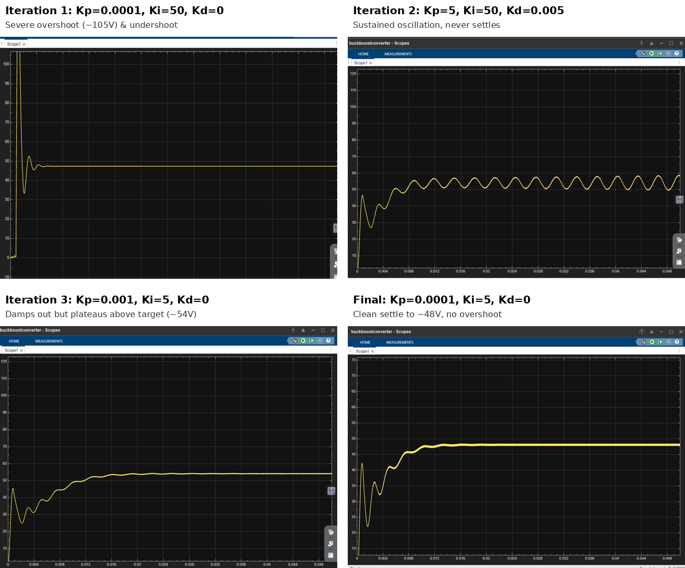
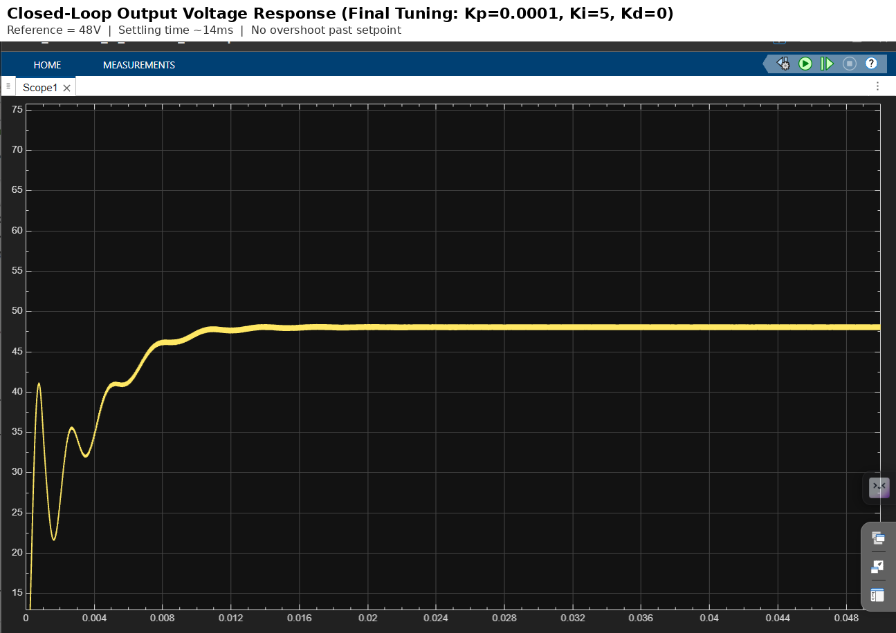

# EV-DC-DC-Boost-Converter-PI-Control

Closed-loop DC-DC Boost Converter designed in MATLAB Simulink using PI control and PWM duty-cycle regulation. The controller maintains a regulated 48 V output under changing operating conditions.

## Overview

This project presents the design and simulation of a closed-loop DC-DC Boost Converter using MATLAB Simulink.

A PI controller continuously regulates the converter output voltage by adjusting the PWM duty cycle. The controller maintains a reference voltage of 48 V, with PWM generated by comparing the PI output against a sawtooth carrier signal.

## Features

- Closed-loop voltage regulation
- PI Controller
- PWM generation using Comparator + Carrier Wave
- MOSFET switching
- Output voltage sensing
- Feedback control
- Stable 48 V output

## Software Used

- MATLAB
- Simulink
- Simscape Electrical

## Control Strategy

Reference Voltage → Error Calculation → PI Controller → Duty Cycle Saturation → PWM Generation → MOSFET → Boost Converter → Voltage Sensor → Feedback

## Circuit Specifications

| Parameter | Value |
|---|---|
| Input Voltage (Vin) | 24 V |
| Target Output Voltage (Vout) | 48 V |
| Theoretical Duty Cycle (D) | 0.5 |
| Inductor (L) | 500 µH (series R = 0.05 Ω) |
| Capacitor (C) | 100 µF (series R = 0.01 Ω) |
| Switching Frequency (fsw) | 50 kHz |
| Duty Cycle Saturation Limit | 0.95 |

## Circuit Components

- DC Voltage Source
- Inductor
- MOSFET
- Diode
- Output Capacitor
- Load Resistance
- Voltage Sensor
- PI Controller
- PWM Comparator
- Repeating Sequence Carrier

## Controller Tuning Process

Several PI/PID gain combinations were tested before arriving at the final configuration:

| Iteration | Kp | Ki | Kd | Observed Behavior |
|---|---|---|---|---|
| 1 | 0.0001 | 50 | 0 | Severe overshoot (~105 V) and undershoot (~33 V) before settling near 47 V |
| 2 | 5 | 50 | 0.005 | Sustained oscillation/ripple around 50–58 V — marginally stable, never fully damps |
| 3 | 0.001 | 5 | 0 | Improved damping but plateaus above target (~54 V) without settling cleanly in the simulation window |
| **Final** | **0.0001** | **5** | **0** | Clean convergence to ~48 V, settling in ~14 ms, no overshoot past setpoint |

Iteration 2 illustrates a classic PI tuning trap: increasing Kp significantly (5 vs. 0.0001) without reducing Ki pushed the loop toward the stability boundary, producing sustained oscillation instead of convergence. The final gains (low Kp, moderate Ki) proved most stable for this converter's dynamics.

## Simulation Results

**Reference Step to 48 V**

- Settling time: ~14 ms (to within ±2% of 48 V)
- Overshoot: None — output approaches 48 V from below without exceeding the setpoint
- Transient behavior: output initially dips to ~41 V, then ~32 V, before rising smoothly to steady state

This initial undershoot is characteristic of boost converter dynamics, not a tuning flaw. Boost converters have a **right-half-plane (RHP) zero** in their control-to-output transfer function, which causes the output to momentarily move opposite to its eventual steady-state direction before settling — a well-known limitation that caps how aggressively the loop can be tuned without instability.

*Output voltage response showing convergence to 48 V setpoint with characteristic RHP-zero undershoot.*

## Future Work / Planned Validation

- Load-step disturbance rejection testing
- Reference tracking under setpoint changes
- Buck-Boost topology
- Bidirectional converter
- Battery charging mode
- Motor drive integration
- Battery Management System interface
- Digital controller implementation

## Author

Vidhanshu Tenwalia

EV Engineering Portfolio
